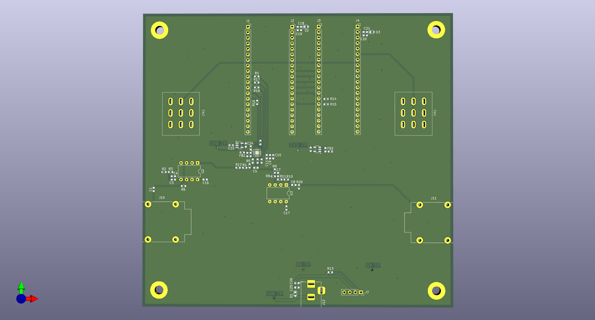

# Kestrel PCB

## Overview

This repository contains the KiCad design files for the main PCB used in Kestrel. The board integrates power distribution, audio I/O, and connectors for the Kestrel Core DSP module, Kestrel Interface control module, and a 5" LCD interface.

The PCB serves as the main carrier board for the system, providing regulated power rails, audio input/output stages, and interconnects between the DSP core, UI processor, and display.

## Dependencies

The board is designed to be used with the following additional components:

- Sipeed Tang Nano 20K (FPGA DSP core)
- Waveshare ESP32-P4-Pico (UI / control processor)
- Waveshare DSI-TOUCH-5A (5" MIPI-DSI display, connected to the ESP32-P4)
- Adafruit MPM3610 5V buck converter breakout

Note: the 5 V rail is currently generated using an external MPM3610 buck module. The PCB is designed so this can be replaced by an integrated regulator in a future revision.

## Power

The board is powered from a standard ***Center negative*** **9 V pedal supply**. The external buck module generates a 5V rail, from which the remaining rails are derived:

- 5 V (buck converter)
- 3.3 V
- 1.8 V

## Project status

Prototype / Rev A. The design has not yet been manufactured and may change significantly.

## Files

This repository contains:

- KiCad schematic and PCB layout
- fabrication outputs (Gerbers, drill files) *to be added*
- board renders and screenshots

## Related projects

This board is part of Kestrel. Other repos in this project include

- [Main repo](https://github.com/linkin-parks-bassist/kestrel)
- [MCU repo](https://github.com/linkin-parks-bassist/kestrel-interface)
- [FPGA repo](https://github.com/linkin-parks-bassist/kestrel-core)

## License

GNU GPL 3.0

## Contact

I'd love to hear from you.  
email: davidjfarrell96@gmail.com
